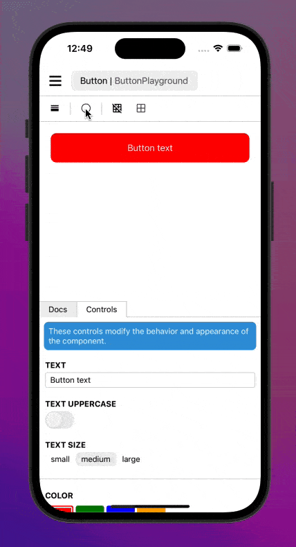

Adds sandbox backdrop manipulation to `react-native-sandbox`.

## Installation

Requires `react-native-sandbox`. Ensure that your sandbox is configured correctly before proceeding.

Open a terminal in your project's folder and run

```shell
npm install @react-native-sandbox/backdrop
```

Modify your sandbox root to load the plugin:

```typescript
import BackdropPlugin from '@react-native-sandbox/backdrop';

// ...

function Sandbox() {
    return <SandboxRoot components={comonents} plugins={[BackdropPlugin]}>
}
```

## Usage

By default all sandboxes will now have the backdrop actions added to the toolbar. Tapping the backdrop icon will iterate through the different backdrop options. (transparent, white, black, gray)



To disable backdrop on a given sandbox you can provide a plugin configuration:

```typescript
import MyComponent from './MyComponent';
import { useDocs } from '@react-native-sandbox/docs';
import documentation from './documentation.txt';


function MyComponentSandbox() { /* ... */ }

export default {
    name: 'My Component Sandbox',
    components: {
        MyComponentSandbox: {
            component: MyComponentSandbox,
            plugins: {
                backdrop: false,
            }
        }
    }
}
```

Support for additional backdrop configuration options coming soon.
