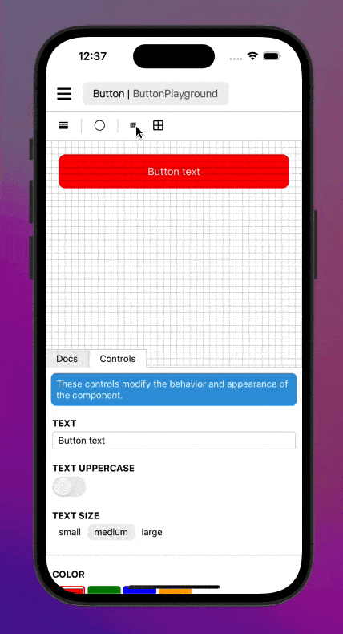

Adds a grid to `react-native-sandbox`.

## Installation

Requires `react-native-sandbox`. Ensure that your sandbox is configured correctly before proceeding.

Open a terminal in your project's folder and run

```shell
npm install @react-native-sandbox/grid
```

Modify your sandbox root to load the plugin:

```typescript
import GridPlugin from '@react-native-sandbox/grid';

// ...

function Sandbox() {
    return <SandboxRoot components={comonents} plugins={[GridPlugin]}>
}
```

## Usage

By default all sandboxes will now have the grid actions added to the toolbar. Tapping the icon will iterate over the different size configurations. (disabled, 10, 20, 50) You can also toggle between a line grid and a dot grid.



To disable grid on a given sandbox you can provide a plugin configuration:

```typescript
import MyComponent from './MyComponent';
import { useDocs } from '@react-native-sandbox/docs';
import documentation from './documentation.txt';


function MyComponentSandbox() { /* ... */ }

export default {
    name: 'My Component Sandbox',
    components: {
        MyComponentSandbox: {
            component: MyComponentSandbox,
            plugins: {
                grid: false,
            }
        }
    }
}
```
